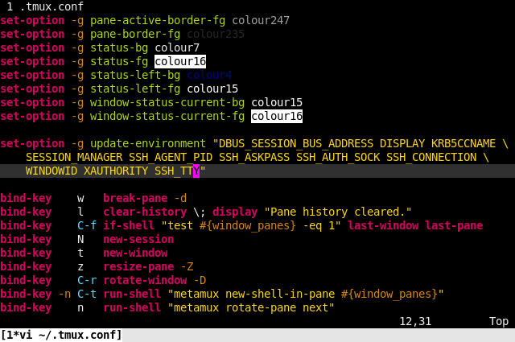

tmux.vim
========

This repository provides a Vim syntax highlighting file for tmux
configurations. The syntax file is generated directly from the tmux source code
using an Awk script. A cron job running on a host managed by the maintainer of
this repository regenerates the syntax file once a day and, if the syntax file
has changed, commits the change then pushes it to GitHub. As such, this
repository should always have a fairly up-to-date syntax file as long as there
has not been any significant refactoring by the tmux maintainers.

The syntax file was derived from [Keith Smiley's tmux.vim][keith-tmux.vim] with
some changes:

- When a color is used (e.g. "colour7"), the text's foreground is changed to
  reflect the color that the number represents. For darker colors, the
  background is changed to white since the text might otherwise be invisible.
- Distinct highlighting has been added for interpolated blocks (`#[...]`,
  `#(...)` and `#{...}`).
- Multi-line strings are supported and correctly correctly highlighted.
- The highlighting style has been modified; what is considered a boolean,
  identifier, etc. in this version of the syntax file differs from Keith's.

This project and all accompanying files (unless stated otherwise) are licensed
under the [2-clause BSD license][bsd-2-clause].

  [keith-tmux.vim]: https://github.com/keith/tmux.vim
  [bsd-2-clause]: http://opensource.org/licenses/BSD-2-Clause

Installation
------------

### Makefile ###

Assuming _make(1)_ is installed and there is an existing Vim directory at
`$HOME/.vim`, running `make install` should be sufficient.

### Plugin Manager ###

This repository should work with most Vim plugin managers that support tracking
Git repositories. Since the files needed by Vim at runtime are in the
subdirectory "vim/", the plugin managers will typically need to be configured
to load files from the correct folder:

- [dein][dein]: `call dein#add('ericpruitt/tmux.vim', {'rtp': 'vim/'})`
- [vim-plug][vim-plug]: `Plug 'ericpruitt/tmux.vim', {'rtp': 'vim/'}`
- [Vundle][vundle]: `Plugin 'ericpruitt/tmux.vim', {'rtp': 'vim/'}`

  [dein]: https://github.com/Shougo/dein.vim
  [vim-plug]: https://github.com/junegunn/vim-plug
  [vundle]: https://github.com/VundleVim/Vundle.vim

Development
-----------

In addition to the Makefile, there are two other components to this repository
used to generate the syntax file. The top portion of the syntax file that
defines syntax-matching regular expressions is found in "./src/header.vim". It
is combined with the output of "./src/dump-keywords.awk", an Awk script that
accepts tmux C source files as arguments then dumps extracted command and
option names. The Makefile and Awk script are POSIX-compliant.

### Makefile Targets ###

- **build:** Download the tmux source code and generate or update the Vim
  syntax file. This is the default target used when none are explicitly given.
- **install:** Install the Vim files in `$HOME/.vim`.
- **sync:** Pull the latest tmux commits, update the Vim syntax file then
  commit the changes. If "PUSH_AFTER_SYNC" is set to "true", the commit will
  automatically be pushed upstream i.e. `make PUSH_AFTER_SYNC=true sync`. The
  default value of "PUSH_AFTER_SYNC" is "false".
